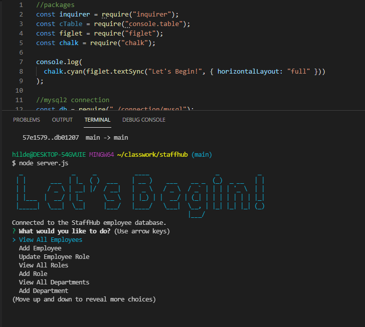

  # StaffHub

  

  ## Table of Contents
  -[Description](#description)

  -[Installation](#installation)

  -[Usage](#usage)

  -[License](#license)

  -[Contributions](#contributions)

  -[Questions](#questions)

  ## Description
  A command-line application for managing a company's employees through node, inquirer, and MySQL.

  ## Installation
  After downloading the code via <code>git clone</code> use the <code>npm i</code> command in the terminal to install the necessary dependencies. Once the dependencies are installed, use <code>mysql -u root -p</code> to start creating the database. Use <code>SOURCE db/schema.sql</code> in the MySQL terminal to create the framework for the database and tables. Afterwards use <code>SOURCE db/seeds.sql</code> to populate the database and tables with some data. Once the database is completed type <code>exit</code> to well... exit. After exiting the MySQL terminal, type <code>node server.js</code> to begin the inquirer prompts.

  ## Usage
  Watch the Instructional Video! Once all steps for installation are completed type <code>node server.js</code> as listed above, to begin the inquirer prompts. The user will be given a sort of central lobby that will allow them to make selections from a list of options such as viewing, adding, and updating data from the database.(expect more options in the near future!) The user will be asked to either enter information or select from a list. They can then simply hit enter which will either move to the next question or display a success message if everything went as planned. The user can then select the view options to be sure that their data was correctly entered.
  
  

  ## License
 
  MIT License

  <https://choosealicense.com/licenses/mit/>

  ## Contributions
  Logan Hildebrandt

  ## Questions
  Contact me with any questions!

  Email: <hildebrandtlogan@gmail.com>

  Github: <https://github.com/LoganHild>

